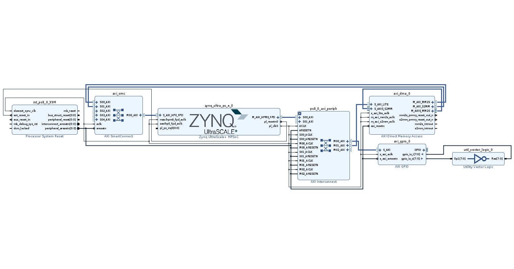

# 实验目的：  
### 在FPGA上板时实现PS端数据传输到PL端，再从PL端传回PS
## 实验工具：
1.vivado 2020.2  
2.vitis 2020.2
3.Xilinx ZCU102开发板

## 实验流程
### vivado部分
1.vivado的使用部分参照上一个实验  
2.打开Block design,添加如下图所示的IP并连线  

3.之后同样是进行电路验证，之后进行综合、布局布线、输出bit文件，最后输出xsa文件  

### vitis部分
1.vitis的使用部分参照上一个实验  
2.vitis部分的C语言代码如下：
```
#include <stdio.h>
#include "platform.h"
//#include "xil_printf.h"
#define base_addr 0x10000000   //DDR地址
#define base_addr2 0x20000000
#include "xil_io.h"
#define BASE_ADDR 0xA0000000  //DMA地址
#include "xil_cache.h"

int main()
{
    init_platform();
   // Xil_DCacheDisable();  直接禁用cache,也可以用下面的暂时禁用cache的方法

    volatile int* gpio_base = (int*)(BASE_ADDR);
    int b;
    print("Hello World\n\r");
    print("Successfully ran Hello World application");
    *gpio_base =0x55555555;
    b=*gpio_base;
    volatile int* testdata = (int*)(0x10000000);
    volatile int* testdata2 = (int*)(0x20000000);
    	for (int i=0;i<512;i++)
   	{
    		*(testdata+i) = i;
    		*(testdata2+i) =0;

    	}

  /*  volatile int* c =(0x10000000);
		*c=1;
		Xil_Out32((0x10000000),1);
		volatile int* c1 =0x10000004;
		*c1=2;

		Xil_Out32((0x10000004),2);
		volatile int* c2 =0x10000008;
		*c2=3;

		Xil_Out32((0x10000008),3);
	volatile int* k1=(volatile int*)(0x20000000);
		volatile int* k2=(volatile int*)(0x20000004);
		volatile int* k3=(volatile int*)(0x20000008);  */


	//	int* c3 =0x10000003;
	//	*c3=4;
//		int* u3=(int*)(0x100000003);
//		int r3=*u3;


		printf("CR is %d\r\n", Xil_In32(0xA0010000 + 0x0));
		printf("SR is %d\r\n", Xil_In32(0xA0010000 + 0x4));


		Xil_DCacheFlushRange(0x10000000,512); //œ«ÄÚÈÝË¢ÐÂÖÁDDR
		Xil_DCacheFlushRange(0x20000000,512);


   		Xil_Out32((0xA0010000 + 0x0),1);//start dma
    	Xil_Out32((0xA0010000 + 0x18),0x10000000);
    	    Xil_Out32((0xA0010000 + 0x1C),0); //set da address
    	   Xil_Out32((0xA0010000 + 0x28),256); //set length

	Xil_Out32((0xA0010000 + 0x30),1); //start dma
	Xil_Out32((0xA0010000 + 0x48),0x20000000); //set da address
	Xil_Out32((0xA0010000 + 0x4C),0); //set da address
	Xil_Out32((0xA0010000 + 0x58),256); //set length


   	//	Xil_Out32((0xA0010000 + 0x0),1);//start dma
    //	Xil_Out32((0xA0010000 + 0x18),0x10000000);
    //	    Xil_Out32((0xA0010000 + 0x1C),0); //set da address
    //	   Xil_Out32((0xA0010000 + 0x28),256); //set length


    	   Xil_DCacheInvalidateRange(0x20000000,512);  //œ«DDRÄÚÈÝÀ­œøCache

    	   xil_printf("CR is %x\r\n", Xil_In32(0xA0010000 + 0x04));
     	   xil_printf("CR is %x\r\n", Xil_In32(0x20000000 + 0x0));
     	   xil_printf("CR is %x\r\n", Xil_In32(0x20000000 + 0x4));

    cleanup_platform();


    return 0;
}
```
3.之后参照上一个实验就可以进行上板调试