本教程将以矩阵乘法为例简要介绍hls的设计流程，主要包括hls中的优化方法、将hls设计的ip导入到vivado中并在SDK中调用。  

工具   
**Vivado 2020.2**  
**Vitis 2020.2**  
**Vitis HLS 2020.2**  
###一、HLS的优化流程  
**Step1** 创建一个HLS工程
1.打开vitis hls之后选择create project,之后需要分别添加设计文件和测试文件，随后指定时钟周期和使用的FPGA开发板  
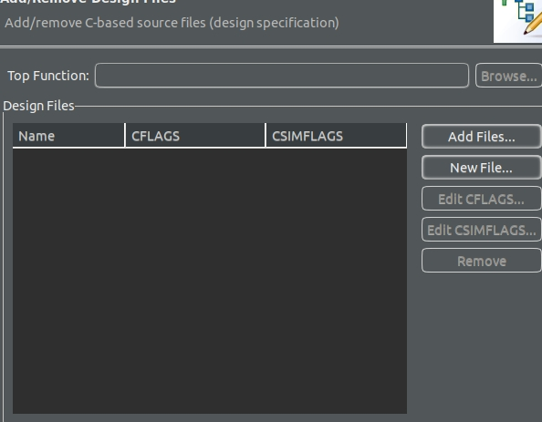
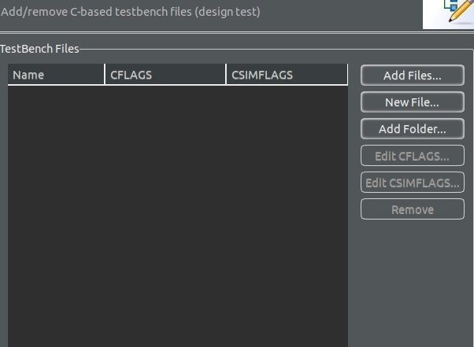
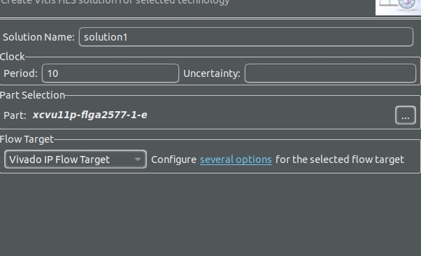
**Step2**
对添加的文件分别执行C语言编译和HLS综合 
以两个16*16矩阵相乘为例，下面是没有优化的矩阵乘法的程序  
```
void matrixmul(
      float a[16*16],
	  float b[16*16],
	  float c[16*16])
{
  // Iterate over the rows of the A matrix
   Row: for(int i = 0; i < 16; i++) {
      // Iterate over the columns of the B matrix
      Col: for(int j = 0; j < 16; j++) {
         c[i*16 + j] = 0;
         // Do the inner product of a row of A and col of B
         Product: for(int k = 0; k < 16; k++) {
            c[i*16 + j] += a[i*16 + k] * b[k*16 + j];
         }
      }
   }
}
```

 这个C程序综合后预估的时间
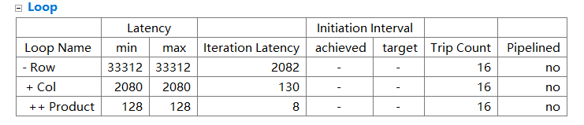
 **Step3**  FPGA能加速的主要原因是提高计算的并行度。计算的并行度增加同一时间需要的数据也要增加，一半大量的数据存在DDR中，一个时钟周期能从DDR中读取的数据是有限制的，因此我们需要先把数据从DDR中转移到FPGA的BRAM中。这个例子的数据量比较小，我们可以一次性读取进来，数据量比较大的时候，FPGA上的储存资源有限，就需要每次读取一部分、计算、写回，然后再继续读取下一部分。下图是增加了读取和写回数据后的程序
```
void matrixmul(
      float a[16*16],
	  float b[16*16],
	  float c[16*16])
{

	float a_buffer[16][16];
	float b_buffer[16][16];
	float c_buffer[16][16];

	Read_a:
	for(int i = 0; i < 16; i++){
		for(int j = 0; j < 16; j++){
			a_buffer[i][j] = a[i*16 + j];
		}
	}
	Read_b:
	for(int i = 0; i < 16; i++){
		for(int j = 0; j < 16; j++){
			b_buffer[i][j] = b[i*16 + j];
		}
	}

  // Iterate over the rows of the A matrix
   Row: for(int i = 0; i < 16; i++) {
      // Iterate over the columns of the B matrix
      Col: for(int j = 0; j < 16; j++) {
         c_buffer[i][j] = 0;
         // Do the inner product of a row of A and col of B
         Product: for(int k = 0; k < 16; k++) {
            c_buffer[i][j] += a_buffer[i][k] * b_buffer[k][j];
         }
      }
   }
   Weite_c:
   	for(int i = 0; i < 16; i++){
   		for(int j = 0; j < 16; j++){
   			c[i*15 + j] = c_buffer[i][j];
   		}
   	}
}

```
**Step4** 综合之后可以看到上面的操作并没能减少时间，反而徒增了读写数据的时间，下面就要加入一些**pragma**来充分利用上面的操作。  

* FPGA从DDR中读取的数据会依此写入BRAM，而BRAM每个时钟周期只能读和写一次，而并行计算需要在同一个时钟周期同时读取一部分数据，所以我们要把需要被同时读取的数据放在不同的BRAM中。这里我们可以使用#pragma HLS ARRAY_PARTITION 或者#pragma HLS ARRAY_RESHAPE，具体的语法可参考ug902。
* 一般提高并行度的方法是对loop进行一些unroll和pipeline的操作，还有一些优化策略比如loop exchange，loop tiling等等都是针对loop进行一些操作，加入pragma或者略微修改一下code从而实现硬件优化。PIPELINE默认把内循环UNROLL，具体内容参照ug902。
* 这个例子是把最内层loop（程序中的Product)展开，也就是同时做16个乘法并累加，然后再做一个PIPELINE。这样我们需要同时获取的数据就是a矩阵一行中的16个数和b矩阵一列的中的16个数，因此我们对a矩阵的列(dim = 2) 和b矩阵行(dim = 1)进行ARRAY_PARTITION(dim = 0是对所有维度都做此操作)。

修改后的程序如下
```
void matrixmul(
      float a[16*16],
	  float b[16*16],
	  float c[16*16])
{

	float a_buffer[16][16];
	float b_buffer[16][16];
	float c_buffer[16][16];
#pragma HLS ARRAY_PARTITION variable=a_buffer dim=2 complete
#pragma HLS ARRAY_PARTITION variable=b_buffer dim=1 complete

	Read_a:
	for(int i = 0; i < 16; i++){
		for(int j = 0; j < 16; j++){
			a_buffer[i][j] = a[i*16 + j];
		}
	}
	Read_b:
	for(int i = 0; i < 16; i++){
		for(int j = 0; j < 16; j++){
			b_buffer[i][j] = b[i*16 + j];
		}
	}

  // Iterate over the rows of the A matrix
   Row: for(int i = 0; i < 16; i++) {
      // Iterate over the columns of the B matrix
      Col: for(int j = 0; j < 16; j++) {
#pragma HLS PIPELINE
         c_buffer[i][j] = 0;
         // Do the inner product of a row of A and col of B
         Product: for(int k = 0; k < 16; k++) {
            c_buffer[i][j] += a_buffer[i][k] * b_buffer[k][j];
         }
      }
   }
   Weite_c:
   	for(int i = 0; i < 16; i++){
   		for(int j = 0; j < 16; j++){
   			c[i*15 + j] = c_buffer[i][j];
   		}
   	}
}
```
所用的时间如下，可以看到进行这些操作以后速度提高了10倍以上。
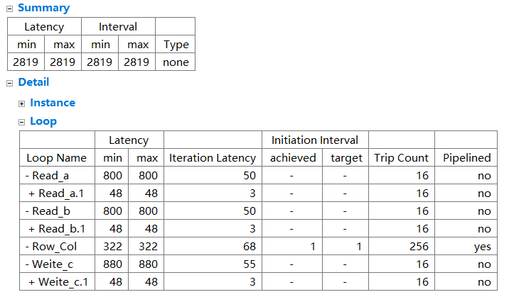
**Step5** 下面就要对I/O进行一些约束。可以参考阅读ug871 Ch.4。PS和PL之间的通信是通过AXI实现的，所以我们用到的接口的类型都是AXI的。I/O的协议可以分为Block-Level I/O Protocols（主要是对整个ip进行控制，比如控制ip的Start，配置读写数据的首地址等等）和Port I/O Protocols（控制读写接口）。我们的设计是ip主动从DDR中读取，所以这里的Port I/O Protocols 选取的是m_axi。以下是这一部分的代码。
```
#pragma HLS INTERFACE s_axilite port=return
#pragma HLS INTERFACE m_axi depth=256 port=a offset=slave bundle=in_a
#pragma HLS INTERFACE m_axi depth=256 port=b offset=slave bundle=in_b
#pragma HLS INTERFACE m_axi depth=256 port=c offset=slave bundle=out_c
```


HLS的基本优化步骤就是这些了，不过这只是一个简单粗糙的优化，以上的例子的还有优化空间。说到优化就是找到一个较为合适的实现方法（可以想象一下你写的程序对应的硬件是如何实现的），然后在时间和资源上trade-off，最后达到你的要求。

在综合完之后需要导出IP,才能在vivado中调用  
点击绿色箭头旁的下拉箭头，选择 Export hardware, 如下图可以设置输出IP的路径
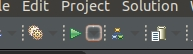
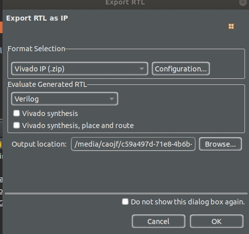
###二、将HLS设计的ip导入到vivado中调用。
**Step1**  参考ug871中的Ch.10 Lab 1: Implement Vivado HLS IP on a Zynq Device
点击vivado中IP catalog 进入IP管理界面  
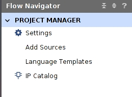
在这个界面空白处右键选择 add repository，选择之前导出IP的路径可以添加IP  
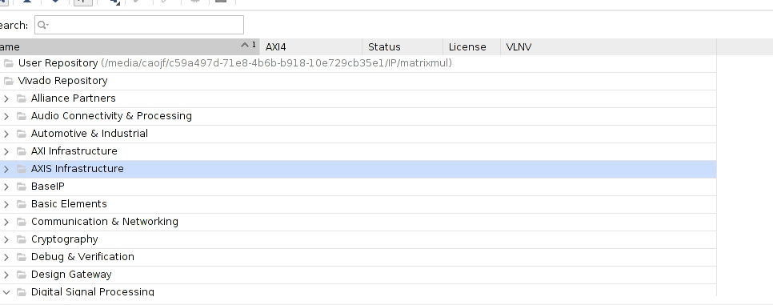

对于这个例子中注意以下步骤
再Run Connection Automation之后得到以下的diagram。
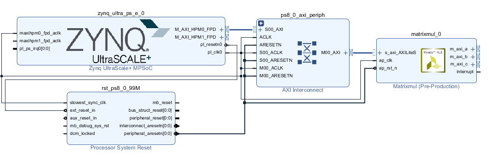
可以看到Matrixmul这个ip的m_axi的port都没有连接，这时我们需要配置一下PS-PL的interface。双击ZYNQ模块，然后如下图select **AXI HP0 FPD**，这样PS端就会出现一个HP口，最后的diagram如下下图。（关于PS-PL之间interface的类型可以自己找些资料看一下。整个Soc系统的结构图大概如下下下图。
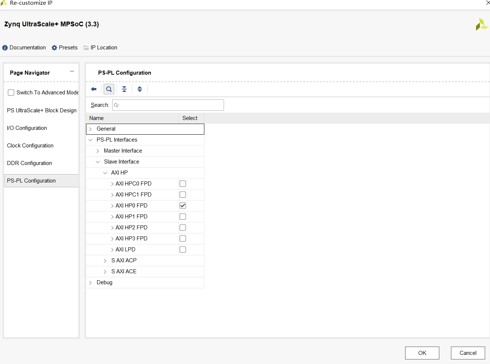
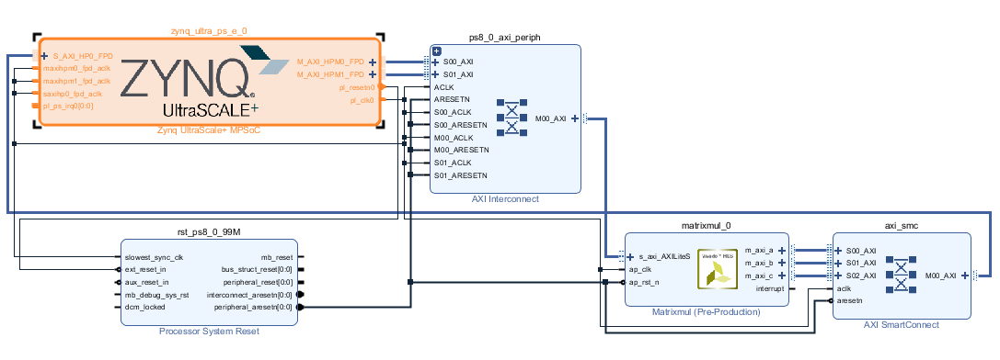
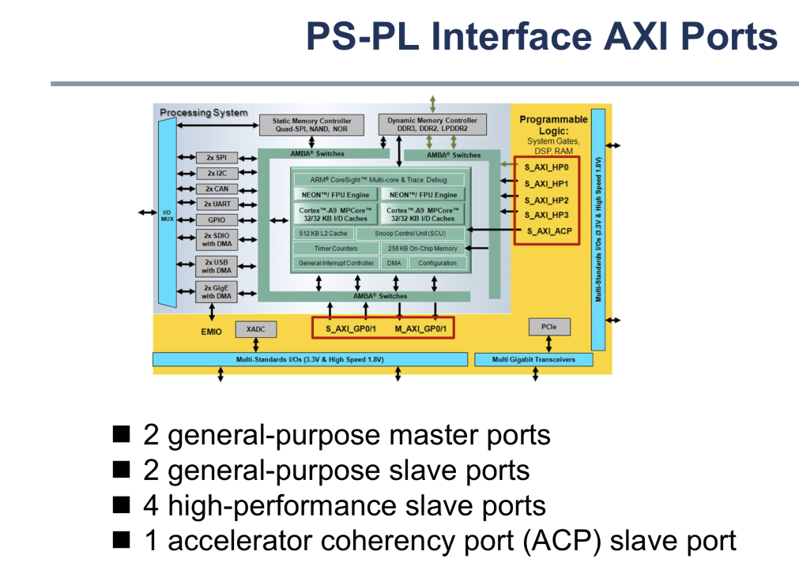
**Step2** 导入到vitis，接下来就需要写c程序来调用刚才生成的ip。

HLS导出ip后会生成一些 Driver File，可以在vitis中 *_wrapper_hw_platform_0 -> drivers -> Matrixmul_v1_0 -> src中查看，里面包含了一些后面需要用到的C函数。

下面是调用HLS IP的例子。
```
#include <stdio.h>
#include <stdlib.h>
#include "xparameters.h"
#include "xMatrixmul.h"
#include "xil_cache.h"
#include "xtime_l.h"

XMatrixmul HlsMatrixmul;

int Matrixmul_init(XMatrixmul *hls_MatrixmulPrt)
{
   XMatrixmul_Config *cfgPtr;
   int status;

   cfgPtr = XMatrixmul_LookupConfig(XPAR_XMATRIXMUL_0_DEVICE_ID);
   if (!cfgPtr) {
      print("ERROR: Lookup of acclerator configuration failed.\n\r");
      return XST_FAILURE;
   }
   status = XMatrixmul_CfgInitialize(hls_MatrixmulPrt, cfgPtr);
   if (status != XST_SUCCESS) {
      print("ERROR: Could not initialize accelerator.\n\r");
      return XST_FAILURE;
   }
   return status;
}


void Matrixmul_start(void *InstancePtr){
   XMatrixmul *pAccelerator = (XMatrixmul *)InstancePtr;
   XMatrixmul_Start(pAccelerator);
}

int main()
{
   print("Program to test communication with HLS block in PL\n\r");
   int status;
   Xil_DCacheDisable();

   //Setup the matrix mult
   status = Matrixmul_init(&HlsMatrixmul);
   if(status != XST_SUCCESS){
      print("HLS peripheral setup failed\n\r");
      exit(-1);
   }

   u32 addr_a = 0x01000000;
   u32 addr_b = 0x01200000;
   u32 addr_c = 0x01400000;

   float *addrptr_a = (float *)addr_a;
   float *addrptr_b = (float *)addr_b;
   float *addrptr_c = (float *)addr_c;

   for (int i = 0; i < 256; ++i)
       {
	   	   addrptr_a[i] = (float)i;

       }
   for (int i = 0; i < 256; ++i)
         {
  	   	   addrptr_b[i] = (float)i;

         }

   XTime tEnd, tCur;
   u32 tUsed;
   XTime_GetTime(&tCur);

   XMatrixmul_Set_a(&HlsMatrixmul, addrptr_a);
   XMatrixmul_Set_b(&HlsMatrixmul, addrptr_b);
   XMatrixmul_Set_c(&HlsMatrixmul, addrptr_c);
   if (XMatrixmul_IsReady(&HlsMatrixmul))
      print("HLS peripheral is ready.  Starting... \n\r");
   else {
      print("!!! HLS peripheral is not ready! Exiting...\n\r");
      exit(-1);
   }

   XMatrixmul_Start(&HlsMatrixmul);
   do{
	   usleep(50);
   }while (!XMatrixmul_IsDone(&HlsMatrixmul));

   XTime_GetTime(&tEnd);
   tUsed = ((tEnd-tCur)*1000000)/(COUNTS_PER_SECOND);
   xil_printf("time elapsed is %d us\r\n",tUsed);


  for (int i = 0; i < 10; ++i){
    printf("Result received.  res_hw[%u] = %f\n\r",i,addrptr_c[i]);
  }

  return 0;
}

```

输出的结果如下，经验证正确。
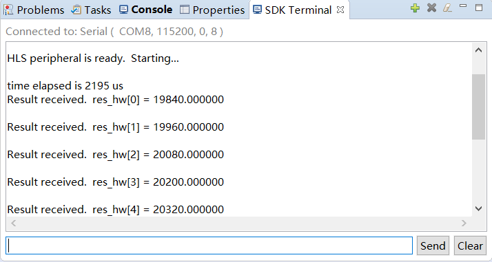
