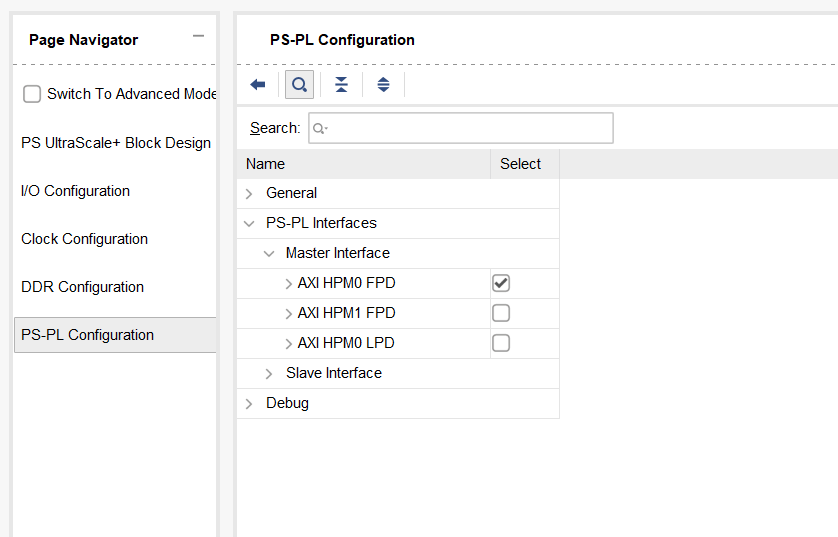
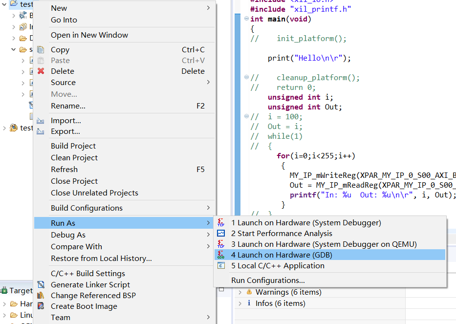

这个教程将介绍如何创建一个IP，并将其添加到一个已经存在的处理器系统中。

**Vivado 2020.2**

1. 首先打开vivado,按照以下流程创建一个project。
    

2. 创建定制IP  
    2.1在vivado界面的左上角选择【Tools】【Create and Package New IP】。
      
    2.2 在Create and Package New IP界面选择【Create a new AXI periheral】。
    
    2.3 编辑IP的信息，根据需求修改名字等信息。
    
    2.4 这里的AXI的【Type】为【Lite】，根据IP的功能设置不同的Type。这里的【Number of register】设置为【4】，这个值是根据这个IP的输入输出的数目设置的，这里展示的是一个很简单的例子，所以选取了最小的数字4。然后点击【Finish】。
    
    2.5 选择【Edit IP】
      
    2.6 进入edit ip界面。可以看到Package IP界面中【Packaging Setting】中的几项前面全是checked，后面进行的更改还需要对此操作。
      
    2.7 在Source界面双击myip_v1_0_S00_AXI_inst,查看Verilog代码。  
      
    2.8 具体一些信号的作用要去了解AXI，这里主要看IP的读写。下图是写操作。  
    
    2.9 下图是读操作。  
      
    2.10 我们进行一些修改，下一个reg是上一个reg的取反。  
      
    2.11 【File Groups】点击【Merge changes from File Groups Wizard】。   
    ****
    2.12 【Review and Package】点击【Re-Package IP】。  
    
    2.13 点击Yes。  
    
3. 使用IP INTEGRATOR把PS和我们设计的IP拼在一起。  
    3.1 点击vivado界面左侧IP INTEGRATOR下的Create Block Design。Specify 一个名字然后OK。  
    3.2 点击【+】，在search中输入zynq选中Zynq UltraScale+ MPSoC
    
      
    3.3 以同样的方式添加我们定制的IP（myip）。   
    3.4 添加之后的样子。     
      
    3.5  依此点击【Run Block Automation】和【Run Connectio Automation】，跳出的界面默认OK就可以。下图是Automation之后的样子。
    
    3.6 双击ZYNQ，弹出一下界面，这里我们没有用到PS和PL之间的HPM1接口，在点击左侧【PS-PL Configuration】，展开右侧【PS-PL Interface】【Master Interface】，uncheck AXI HPM1 FPD。点击 OK。  
    
    3.7 在Diagam界面右键选择【Vilidate Design】或者【F6】。然后可以看到Validation Successful。  
4. 把FPGA的部分导出到vitis。  
    4.1 在Source 界面右键design_1.bd,点击【Create HDL Wrapper】，弹出的界面默认如下，点击OK。
    
      
    4.2 在Source 界面右键design_1.bd，点击【Generate Output Products】。
      
    4.3 在vivado左侧界面，依此点击【Synthesis】【Implementation】【Generate Bitstream】  
    4.4 在vivado界面下，选择【File】【Export】【Export Hardware】。出现【Export Hardware】界面，check【Include bitstream】。OK。
    4.5 打开vitis。

5. 在vitis中为前面构建的硬件编写软件应用程序并上板运行。  
    5.1 在vitis界面中点击【File】【New】【Application Project】。
    5.2 点击Next 选择Empty Application。   
    5.3 右键新建的test文件下的src，依此点击【New】【File】创建c文件。c文件如下。前面Verilog中的每个寄存器的位数是32，每个寄存器的地址差4bytes。下面的代码实现的是给第一个寄存器写入一个数，然后读取第二个寄存器的数据，该数据是第一个寄存器的取反。
      
    5.4 将板子上的开关扳到如下图。  
      
    5.5 接通板子电源，用USB线将板子JTAG和UART接到电脑USB接口。
      
    5.6 vitis界面中点击【Xilinx】【Program FPGA】。   
    5.7 右键test文件，【Run As】【Launch on Hardware】。
    
    5.8 运行得到一下结果。  
    
    

