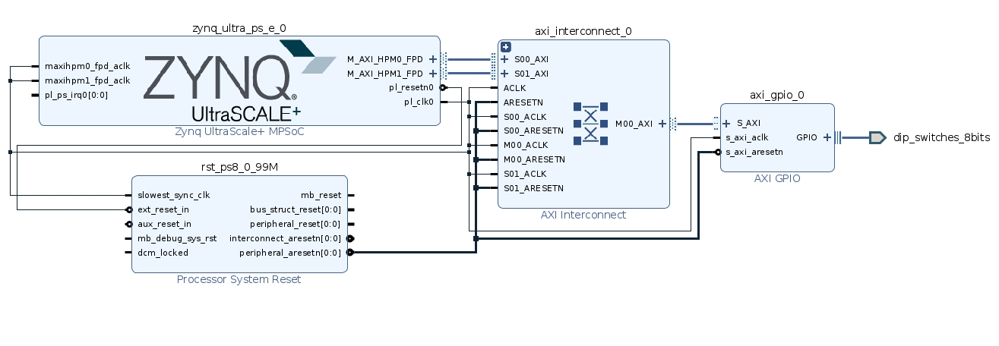

# 实验目的：  
### 在FPGA上板时控制PS端访问PL端的寄存器
## 实验工具：
1.vivado 2020.2  
2.vitis 2020.2
3.Xilinx ZCU102开发板

## 实验流程
### vivado部分
1.启动 vivado 2020 点击图中的“creat project”  

2.指定工程名称和工程目录  

3.选择 RTL project  

4.在Boards部分选择ZCU102开发板  

5.在Flow Navigator 中选择 create block design  
  
6.在Diagram部分 点击 “+”符号，添加IP  

7.添加好各个模块之后用AXI总线连接，如下图所示：
  
8.按F6键或者点击上面的validate design可以验证连线是否正确  
9.之后可以就可以进行“run synthesis” "run lmplementation" 以及"generate bitstream"生成比特流文件  
10.生成比特文件之后需要导出xsa文件，依次点击File、Export、Export Hardware,之后需要选择 include bitstream，导出xsa文件

### vitis部分
1.启动vitis 2020，选择create platform project  

2.输入项目名称，并继续  
3.选择在vivado输出的.xsa文件，之后点击finish  
4.创建完platform之后，在左侧Explorer栏右键点击刚刚创建的项目名称，选择NEW-application project  
5.一路点击NEXT，其中一步需要指定application project的名称
6.在src目录下可以编写bare-metal要执行的C语言文件，本次实验的C语言代码如下：
```
#include <stdio.h>
#include "platform.h"
#include "xil_printf.h"
#include "xil_io.h"
#include "xil_cache.h"
#define addr 0xa0000000 //vivado在block design的address中查看gpio的地址
int main()
{
    init_platform();
    Xil_DCacheDisable();
    volatile int* gpio_base = (int*)(addr);
    int b;
    *gpio_base=0x55555555;
    b=*gpio_base;

    print("Hello World\n\r");
    print("Successfully ran Hello World application");
    cleanup_platform();
    return 0;
}
```
7.编译项目，选中项目然后点击最上方的project，选择build project  
8.编译成功后，将ZCU102连上电源并且与电脑相连，并且将开关调到如下所示，打开开关，才可以进行bare-metal调试   
    
   
 9.将比特文件和调试程序烧录到开发板上，右键选中创建的项目，选中“debug as”--" launch on hardware (gdb)",即可开始调试